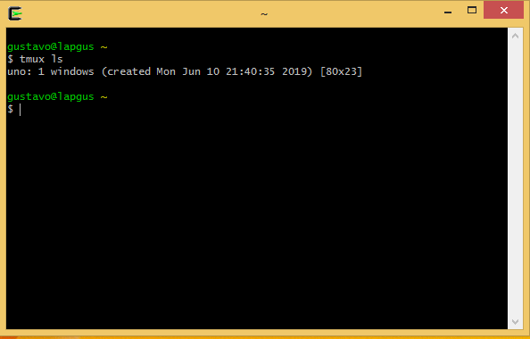

# comandos consola
> notas tmux es un multiplexor de terminal para sistemas tipo unix solo funcionan en tmux 
1 para mandarle el comando a tmux siempre va a ser
```shell
ctrl + b
```
1.1. para abrir tmux se utilza el siguiente comando:
```shell
tmux
```
2. para ver el listado de terminales tmux se utiliza

```shell
  tmux ls
```


3. para reingresar a una terminal de tmux que esta abierta
```shell
  tmux attach-session -t [nombre de la session]
```
3.1. para poder subir lineas en la consola
```shell
ctrl  b + [
```
4. para crear nuevas pestañas
```shell
ctrl b + c
```
5. para renombrar ala consola
```shell
ctrl b + ,
```
6. para recorre las pestañas pára delante
```shell
ctrl b + n
```
7. para recorrerlas para atras
```shell
ctrl b + p
```
8. para ir directo ala pestaña
```shell
ctrl b + [numero de la pestaña]
```
9. para cerrar una pestaña
```shell
ctrl b + &
```
